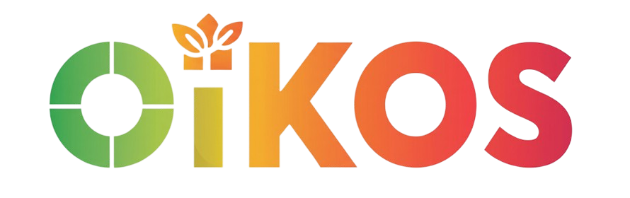

<p align="center">
  
</p>

# 🌍 Oikos - Projet de Réduction de l'Empreinte Carbone (Viveris)

Bienvenue sur le dépôt du projet Oikos, réalisé dans le cadre du Projet Génie Logiciel pour Viveris. Cette application vise à accompagner les utilisateurs dans la réduction de leur empreinte carbone via une approche communautaire (B2B) et ludique (gamification, streak, défis).

---

* **Auteurs** : Morgan PHILIPPE, Titouan BEAUVERGER, Julie KUEMKONG, Marko BABIC, Samy TCHOKOUNTE, Simon KHAN, Celena MAKOLE KANOUO 
* **Les parties prenantes coté Viveris** : Victoria Cueff (Directrice adjointe Marketing) et Robin Marien (Chef de projet IT)

## Guide de démarrage

Ce guide est conçu pour vous permettre de lancer l'application même si vous n'avez jamais utilisé Flutter ou un environnement de développement.

### Étape 1 : Prérequis
Pour faire tourner l'application, vous aurez besoin de trois outils principaux :
1. **Git** : Pour récupérer le code source.
    * Téléchargez et installez Git depuis [git-scm.com](https://git-scm.com/).
2. **Flutter SDK** : Le moteur qui permet de compiler le code.
    * Allez sur [flutter.dev](https://flutter.dev/docs/get-started/install), téléchargez le SDK pour votre système (Windows/Mac/Linux) et extrayez-le dans un dossier (ex: `C:\src\flutter`). Ajoutez ensuite ce chemin à vos variables d'environnement.
    * Version : Flutter 3.7.0 ou supérieure.
3. **Android Studio, Visual Studio Code ou autre...**  : Pour écrire le code et utiliser un simulateur de téléphone.
    * Android Studio : Téléchargez [Android Studio](https://developer.android.com/studio). Lors de l'installation, acceptez les paramètres standards (cela installera automatiquement le SDK Android nécessaire).
    * Visual Studio Code : Téléchargez [VS Code](https://code.visualstudio.com/) et installez l'extension Flutter.

### Étape 2 : Configurer un téléphone virtuel (Émulateur)
a) Sur Android Studio :
1. Ouvrez Android Studio.
2. Allez dans **Device Manager** (Gestionnaire d'appareils) et cliquez sur le bouton **Create Device** (ou le petit "+").
3. Choisissez un modèle de téléphone (ex: Pixel 6) et téléchargez une image système récente (ex: API 34).
4. Lancez l'émulateur en cliquant sur le bouton "Play" (triangle vert).

b) Sur Visual Studio Code :
1. Ouvrez VS Code.
2. Ouvrez la palette de commandes (Ctrl+Shift+P) et tapez "Flutter: Launch Emulator".
3. Sélectionnez un émulateur déjà configuré ou suivez les instructions pour en créer un nouveau.
4. Lancez l'émulateur.

### Étape 3 : Récupérer et lancer le code via le terminal
1. Ouvrez un terminal et clonez ce dépôt (téléchargement du code) :
   ```bash
   git clone https://github.com/morganphlp/oikos.git
   ```
2. Installez les dépendances du projet et les librairies : 
    ```bash
   cd oikos
   flutter pub get
   ```
3. Lancez l'application : 
    ```bash
   flutter run
   ```

## 🏗️ Architecture du projet => Clean Architecture

Pour garantir la pérennité et la maintenabilité de l'application, nous appliquons strictement les principes de la **Clean Architecture**. L'application est découpée par fonctionnalités (*features*).

Voici le résumé de l'arborescence du dossier `lib/` (le cœur du code) :

### 1. Le dossier `core/`
Il contient tout ce qui est transversal à l'application.

* **`theme/`** : Les couleurs, boutons et polices (ex: `app_colors.dart`).
* **`error/`** : La gestion standardisée des erreurs (`failures.dart`, `exceptions.dart`).
* **`common/`** : Les widgets réutilisables partout (ex: `gradient_button.dart`, `navbar.dart`).

### 2. Le dossier `features/`
C'est ici que se trouve le code principal, découpé par **fonctionnalités** indépendantes (ex: `actions`, `auth`, `bilanCarbone`, `community`, `dashboard`, `home`, `notifications`, `profile`, `streak`).

Chaque fonctionnalité est strictement divisée en 3 couches :

* 🔵 **`presentation/` (L'interface Utilisateur)**
    * **Rôle** : Afficher les données et capter les actions de l'utilisateur.
    * **Contenu** : Les pages (`pages/`), les composants visuels (`widgets/`) et les gestionnaires d'état (`bloc/` ou `cubit/`).
    * **Exemple** : `dashboard_page.dart` affiche la page de statistiques.

* 🟣 **`domain/` (La Logique Métier)**
    * **Rôle** : Le cœur de l'application. Ne dépend d'aucune librairie externe (pas de code Flutter visuel, pas d'appels HTTP).
    * **Contenu** : Les modèles de données purs (`entities/`), les actions possibles (`usecases/`) et les contrats pour récupérer les données (`repositories/`).
    * **Exemple** : `calculer_progres_use_case.dart` contient la logique de calcul de la "Streak".

* 🟢 **`data/` (L'accès aux Données)**
    * **Rôle** : Discuter avec l'extérieur (Base de données Supabase, API Publicodes, stockage local).
    * **Contenu** : Les modèles de données techniques (`models/`), les appels réseau (`datasources/`) et l'implémentation concrète des contrats (`repositories_impl/`).
    * **Exemple** : `auth_remote_data_source.dart` gère la connexion réelle via l'API Supabase.

---

## 🛠️ Règles de contribution

Pour garder une base de code propre et maintenable, veuillez respecter ces 3 règles d'or :

1. **La règle des dépendances** :
    * `presentation` peut faire appel à `domain`.
    * `data` peut faire appel à `domain`.
    * ⚠️ **Attention** : `domain` ne doit **jamais** dépendre de `presentation` ni de `data`.
2. **Gestion d'état (State Management)** : Les fichiers d'interface (les `Widgets`) ne doivent pas contenir de logique complexe. Utilisez le pattern BLoC/Cubit pour séparer la logique de l'affichage.
3. **Cas d'usage (Use Cases)** : Chaque action métier (ex: "Valider un défi", "S'inscrire") doit avoir sa propre classe `UseCase` dans le dossier `domain/usecases/`.